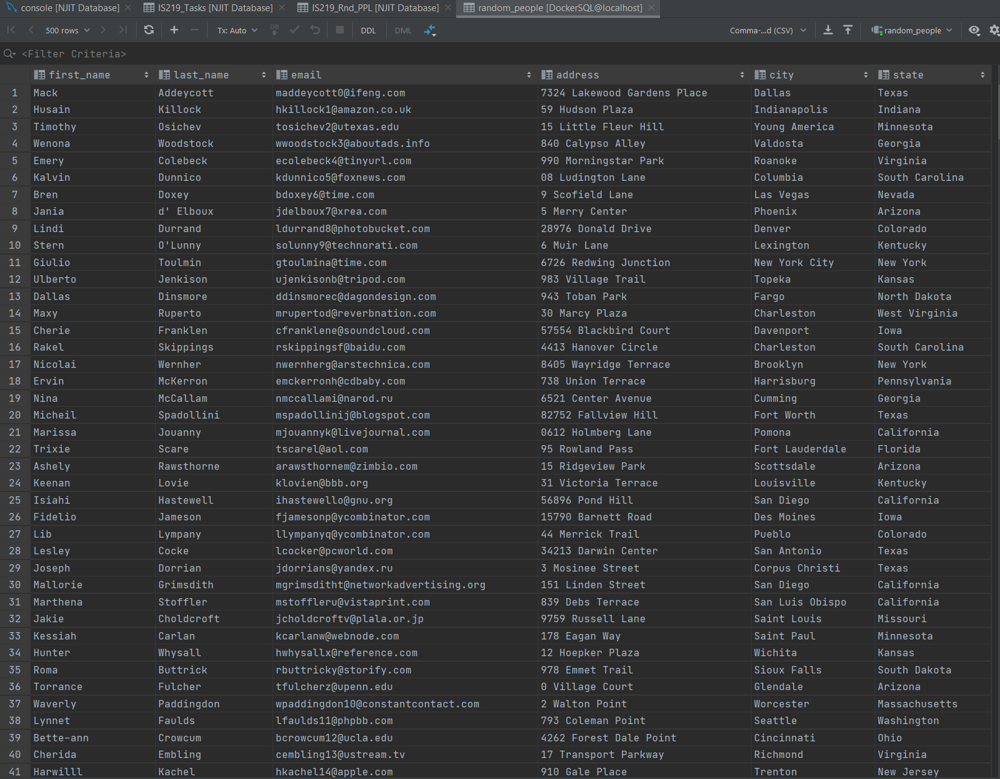
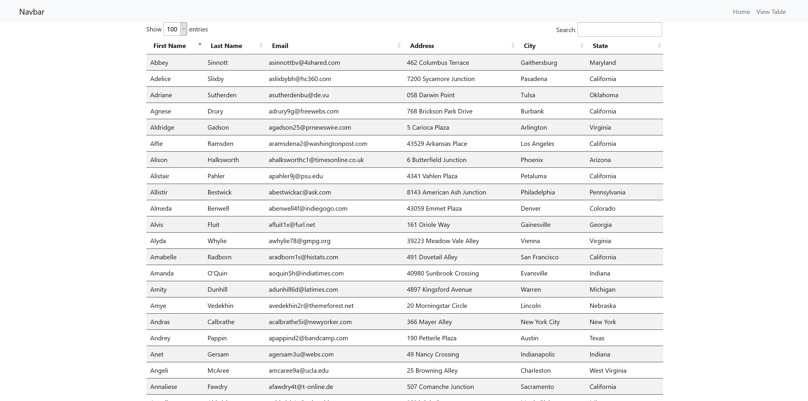
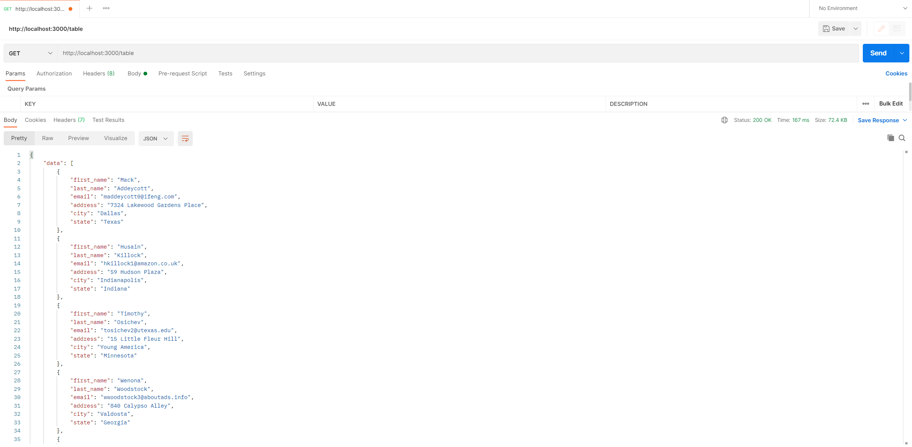
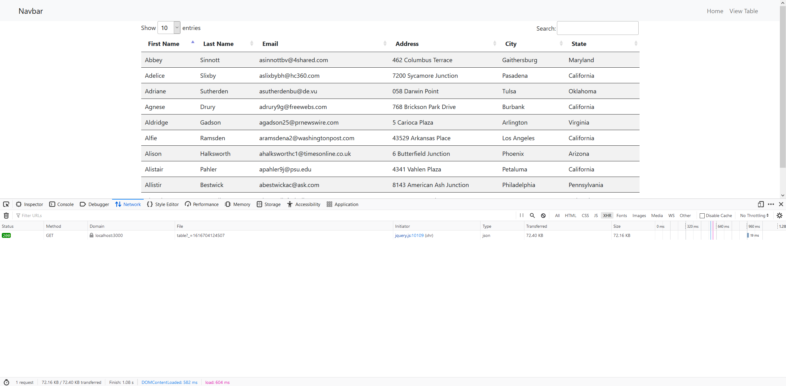

# IS219 React API w/Data Table Implementation
In this project we were assigned to create a REST api and display the data in a jQuery Datatable
### Table in DataGrips (Since I couldn't access it in WebStorm)

### Table in Browser w/DataTable

### Postman Screenshot

### XHR Network Request
